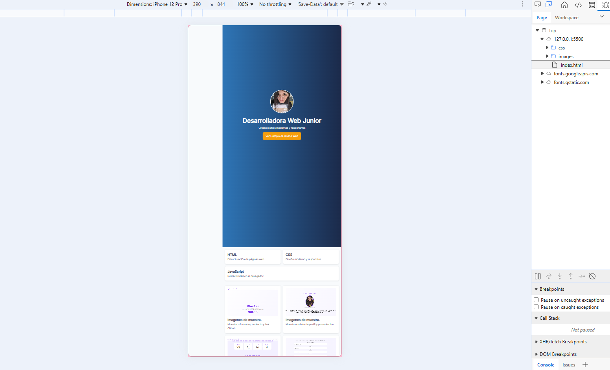
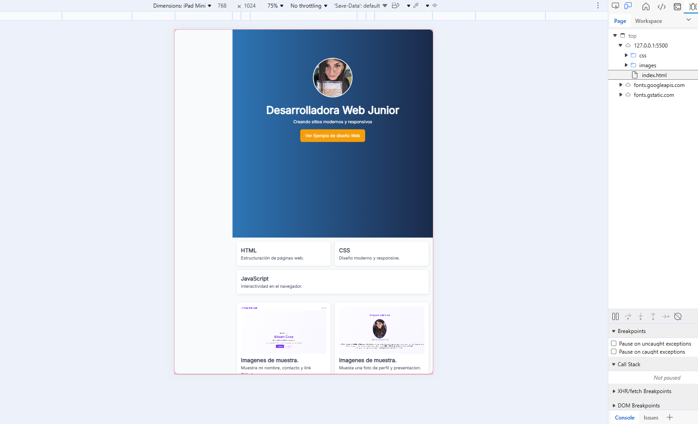
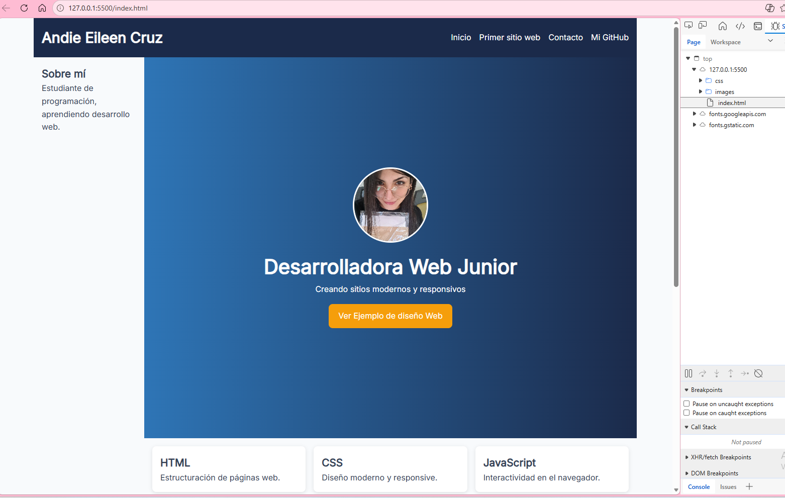

# Portfolio Web - Andie Eileen Cruz

## Descripción
Este proyecto es un portfolio web personal desarrollado como Trabajo Práctico Integrador para la materia Prácticas Profesionalizantes II.

El objetivo fue aplicar CSS avanzado, Flexbox, Grid y diseño responsive Mobile-First.

---

## Sitio en vivo
https://github.com/eileencross/tp-integrador-portafolio

---

## Tecnologías utilizadas
- HTML5
- CSS3
- Flexbox
- CSS Grid
- Responsive Design
- IA
---

## Diseño Responsive

### Mobile

### Tablet

### 💻 Desktop

---

## Estructura del proyecto
index.html
contact.html
css/style.css
images/
README.md

---

##  Funcionalidades
- Navbar con Flexbox
- Hero section con imagen de perfil
- Tarjetas de habilidades
- Galería de proyecto
- Formulario de contacto
- Diseño responsive

---

##  Autora
Andie Eileen Cruz